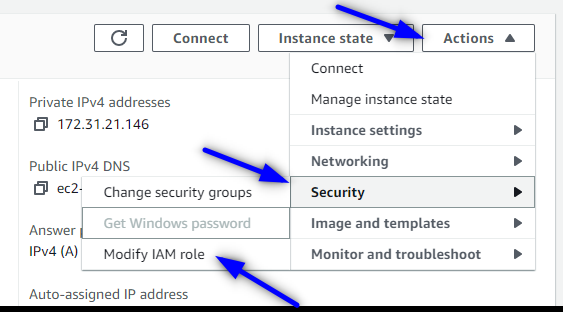

# Create a DynamoDB Table with the AWS Console

DynamoDB is a fully managed NoSQL database with fast, predictable performance and seamless scalability. It allows you to create database tables that can store and retrieve data.

### Project Objectives
- Create a DynamoDB table.
- Create a Ec2 instance.
- Using an IAM role and the principle of least privilege, grant the EC2 instance read access to DynamoDB.
- Use the AWS CLI in the EC2 instance to scan the DynamoDB table.
- Use the AWS CLI in the EC2 instance to validate you cannot write an item to the DynamoDB table.

### Prerequisites
- AWS account

### Step 1
To create a DynamoDB table login to the AWS console and navigate to `Database` and then `DynamoDB`. Click on `Create Table`.

On the create table screen you will add the table details. You can give your table a name, add a `Partition key` and add a `Sort Key`. A partition key is a hash value that is used to retrieve items from your table. A sort key is optional and acts as another column in your table. A partition key and a sort key together create a composite key, this allows items to share the same partition key. For the partition key I chose “Genre” since multiple shows may have the same genre. So for the sort key I chose the title of the show.

Leave all other settings default and click on `Create table`.

Next click on your newly created table then click `Explore table items`. Then you will want to click `Create item`. On this page it should show your partition key and sort key. Here you can add the data of your choosing to your table!

Keep creating new items until you are satisfied with your table.

And there you have created your DynamoDB table.

### Step 2
Next we will move to the EC2 dashboard in the AWS console. Here you will click on `Instances` and `Launch instances`. I chose `Amazon Linux AMI` and `T2.micro` instance type.

All other settings leave at Default and click `Create instance`. Verify your instance is running as shown below.

### Step 3
Now we will go to the Identity and Access Management dashboard to create a new IAM role. Click on `Roles` and `Create a role`. For `trusted entity` select `AWS` and for `use case` select `EC2`.

Hit next and you will be brought to the `Add Permissions` screen. Here type in `DynamoDBReadOnlyAccess` and select that permission.

Click next. Give the role a name and click `Create role`.

### Step 4
We will now use the IAM role to grant EC2 instance access to our DynamoDB table. We will do this by navigating back to our EC2 instance and selecting it. Then click on `Actions` > `Security` > `Modify IAM Role`.

Select the DynamoDB read access role and click `Update IAM role`.

### Step 5
For this step we will be scanning our DynamoDB table in the AWS CLI. To do this select your instance in the console and click `connect`.

Click `Connect` again on the next screen and this will launch the AWS CLI.

Here we will enter the command below to scan the table. The bold print is where you will input your own table name and region.

`aws dynamodb scan --table-name NetflixShows --region us-east-1`

The following was the output.

This shows that the scan was successful and has all 10 items from my table.

### Step 6
Now we will try to add another item to the DynamoDB table. This should not work since the permissions we gave the instance were to read only. Here I will try to add the title “Is it Cake” with the reality genre.

`aws dynamodb put-item --table-name NetflixShows --item '{"Genre": {"S": "Reality"},"Title": {"S": "Is it Cake"}}' --region us-east-1`

The ouput shows that it indeed was not cake. It states we are not authorized to perform a PutItem. Meaning our EC2 instance only has Read permissions, not write, which is exactly what we set out to accomplish!

### After Work
Be sure to terminate your instance!

## Credit
Give Credit to Melissa Gibson
https://aws.plainenglish.io/how-to-create-a-dynamodb-table-with-the-aws-console-92d2bfdd49b

It's for studying purpose.